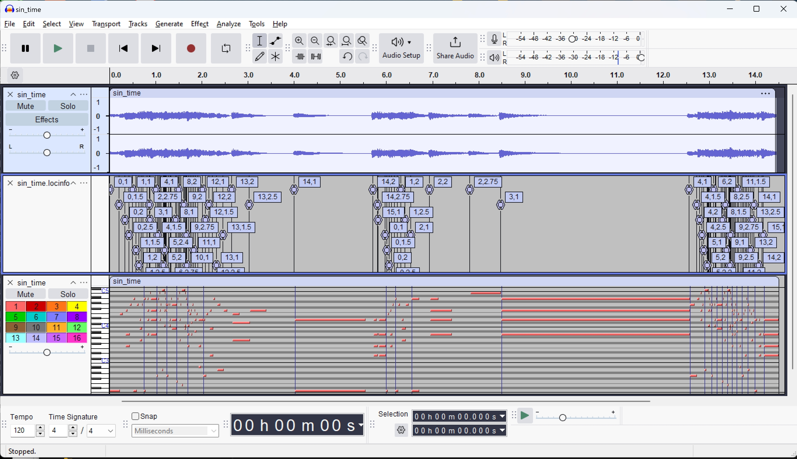
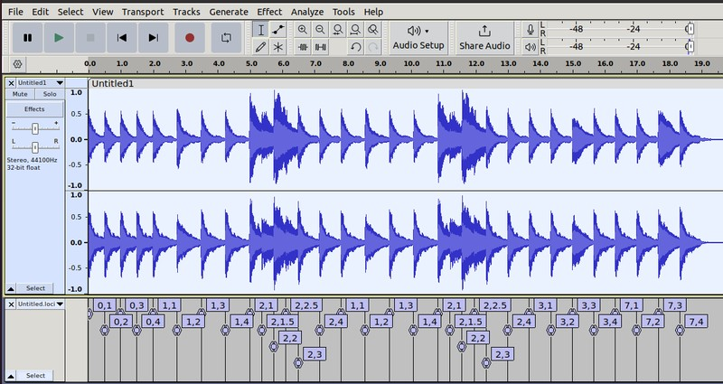

# Synthetic "Score following" data generation

The idea is that we want to identify points in audio files with points in XML and midi files where note events occur. 

Essentially, we create label files with time stamped measure/beat labels. This starts with a plug-in for Musescore 3.6 running on Ubuntu that generates the (time, measure, beat) location info. It also includes various utilities for manipulating the timing of a performance and creating the new label files. Additional utilities just print out info about files for checking and testing.

**Note:** the labels give you measure and beat (floating point to get portions of a beat) wherever there is at least one note event in the score. It doesn't label other events, and it only write out one event time/location for a given location. It also "performs" repeats using the original labels for the measures. 

## Workflow
1) Open a musicXML score in MuseScore, save it as a .mscz file.
2) Export a midi file for the score
3) Export audio for the score
4) Run the location plugin choosing an output file for the resulting .json file
5) run json2txt.py to create the readable (human as well as Audacity) label file. 

That's it. You can have a [midi, audio, label] file set and can identify the correspondence between the midi file and the audio file and the original score using the time-stamped labels. 

**(**optional**)**

6)  Run the "straight" midi file (#2 above) through  **tempovariator.py** defining a function for varying the tempo to produce a time-manipulated midi file
7) Run the "straight" time stamped label file through the **miditimemapper.py** to get the new label file with the new times that all the labels from the original label file map to. 
8) Generate the time-manipulated audio file by rendering the midi file to audio using any midi synthesizer (e.g. [fluidsynth](https://www.fluidsynth.org/)). 

Now you have a new and different [midi, audio, label] set that you can align with the original score! 

You can look at all 3 files [audio, midi, label] nicely aligned in Audacity:




## MuseScore

The timestamp event plugin has only been known to work in MuseScore 3.6. running on Ubuntu 20.04 or (yes, its true) Windows WSL2 (Ubuntu). I use the appimage:
MuseScore-3.6.2.548021370-x86_64.AppImage
retrieved from https://ftp.osuosl.org/pub/musescore-nightlies/linux/3x/stable/

For more information, see "Older and unsupported version" at [MuseScore downloads](https://musescore.org/en/download).


## MuseScore Plugin

You will find the **export-location-info-phys.qml**  plugin in /plugins. You must "install" it in MuseScore in order to use it. Installing was a bit strange. I recall doing this:

    Open Plugins->Plugin Creator
        a) load ./plugins/location-info.qml into the built-in editor (no need to edit it)
        b) save it in the plugin directory  
        c) now you should see it in Plugins->Plugin Manager. Select it and click 'OK'  
        d) Load a musicXML score (might need to be in the .mscz format)  
        e) Run the plugin with Plugins->Plugin Manager -> location-info
        f) It allows you to choose the directory for saving the time/label .json file. 

One unfortunate feature is that the workflow can not be run from the command line, and thus cannot be 'batched.' This is because the unrolling of repeats is done in a way that includes and depends on the score display. That means the original score to [midi, audio, labels] files must be done from the MuseScore GUI. However, all the timing (and other) variations can be done in python and batched (which is probably where most of the data generation is done, anyway.)

The person who wrote this plugin  (before my minor mods) is the uber-hacker, mirabilos (https://github.com/mirabilos and https://launchpad.net/~mirabilos .


## Label Files

The plugin exports a .json file with everything you need in the "time-positions" attribute - a list of lists of time (in seconds), measure (0 based index) and beats (float with decimal part being beat divisions). I run this through a little python utility, /pyutils/ json2txt.py that creates a text file, where each line corresponds to a single event label and looks like this: 

5.729   5.729   6,2.75

with a start and end time in seconds (which are always identical) and the event label (in this case measure 6, beat 2, the third "sixteenth" note that occurs three quarters of the way through the beats). This is easy to parse if you are (for example) training a neural network, but is also the "labels" file format for Audacity (see **Visualizing** below)


## Python Utilities

There are a few core python utilities for generating timing variations in /pyutils:

1) **thorsten2audicity.py** - takes the .jsn file generated by the MuseScore plugin and generates the friendlier time-stamped label .txt file (in the same directory as the .jsn file)

2) **tempovariator_time.py**  [-h] -m MIDI -om OUTPUT -p PERIOD -a AMPLITUDE -sp SPACING

   MIDI input file, MIDI output file, PERIOD parameter for the timing curve, AMPLITUDE parameter for the timing curve, SPACING of the tempo change messages to insert in seconds.

   To make different timing curves, edit the function in the file which is currently (see "Time variations" section below), and change the timing-curve specific command line parameters.

   If you want to make tempo variation not in clock time, but in musical time units (actually in ticks which is a high resolution , e.g. 480/ticks-per-beat), there is also 

   ​	**tempovariator_ticks.py** [-h] -m MIDI -om OUTPUT -p PERIOD -a AMPLITUDE -sp SPACING

   ​	Here, PERIOD and SPACING are in ticks so you can put tempo variation landmarks on specific notes in the piece. 

3) **miditimemapper.py** [-h] -m1 M1 -m2 M2 -it IT -ot OT

   Produces a new labels file which has the new time-stamps for every label in the original label file. 

   M1 is the original midi file, M2 is the time-manipulated file, IT is the original labels file, OT is the new output label file. 

Then just for fun and insight in /pyutils

4) **midiparser.py** [-h] -f FILE

   Prints out a time stamped list of every event in a midi file FILE (not just the ones in the label file)


###### More on time variations with tempovariator_x.py

You can generate timing variations (useful since MuseScore renderings are "straight" using only tempo markings, but not expressive timing such as accel. and rit.). Rather than processing musicXML scores to add timing fluctuations (and then using the plugin to generate the new label file), there is a utility for temporally manipulating the midi output instead, and then for processing the original label file to adjust the label time stamps for the manipulated midi. 

What this tempo variation program does is change the original tempo by some dynamically changing factor and adding MIDI tempo messages to Track 0 at period intervals (e.g. every .1 sec). (There is another filter that computes the tempo variation in ticks rather than time - remember the number of ticks have units of beats, not clock time). 

(Why did we do it this way, you ask, when the MuseScore already has the labeling plugin? Well, the MIDI file already has timing info in delta ticks (using high resolutions such as 480 ticks per musical beat), and repeats are already "unrolled" so it just seemed more straightforward than parsing the musicXML to add tempo markings there.)

###### Timing variation function example (and default in the tempovariator_time.py)

```python
def sine_wave(period, amplitude, time):
    """
    A sin wave interpreted as units in octaves (eg,  sin[-1,1] maps to [.5, 2]).
    """
    frequency = 2 * math.pi / period
    sine_value = math.sin(frequency * time)
    return 2 ** (sine_value * amplitude)
```


## Visualizing

You can use Audacity to visualize audio, labels, (and midi) all lined up in time. 



This helps in understanding/debugging, but Audacity sometimes does weird small adjustments in time so the data might actually be more accurate than it looks!

Also, if you happen to be running Audacity under WSL2 and sending audio to a server (e.g. pulseaudio) running on the Windows side, you'll get long latencies when playing (significant lag between playback cursor and audio). 


### Contact Info

For any questions or inquiries, please contact:

- **Name**: Lonce Wyse
- **Email**: [lonce.acad(_at_)zwhome.org](mailto:lonce.acad@zwhome.org)

